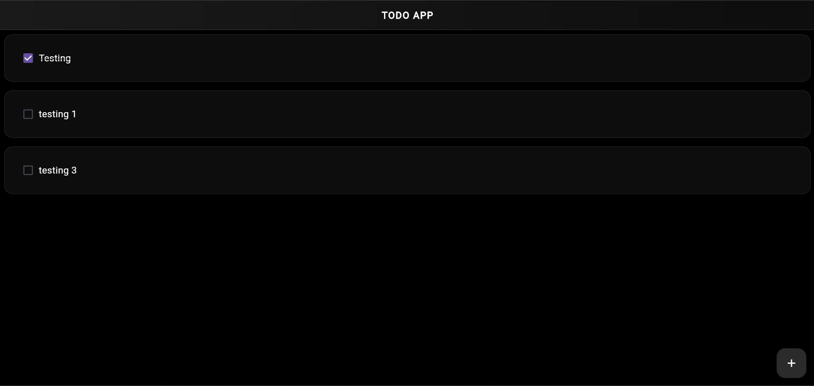
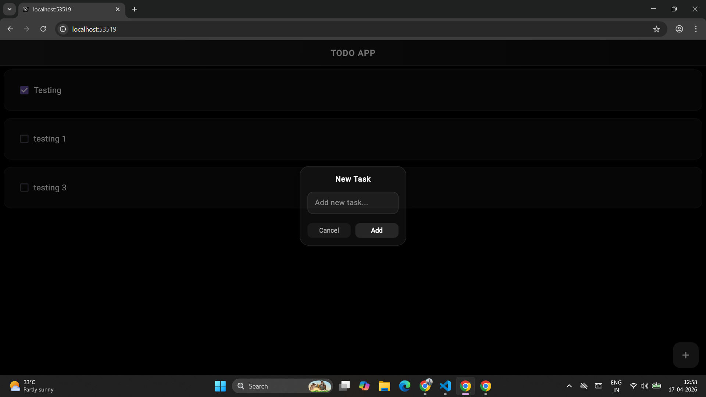
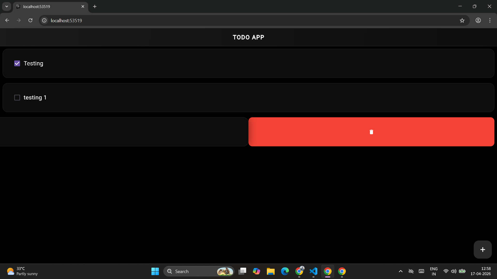
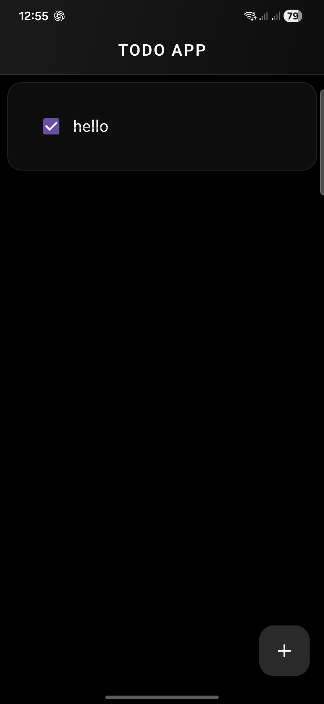
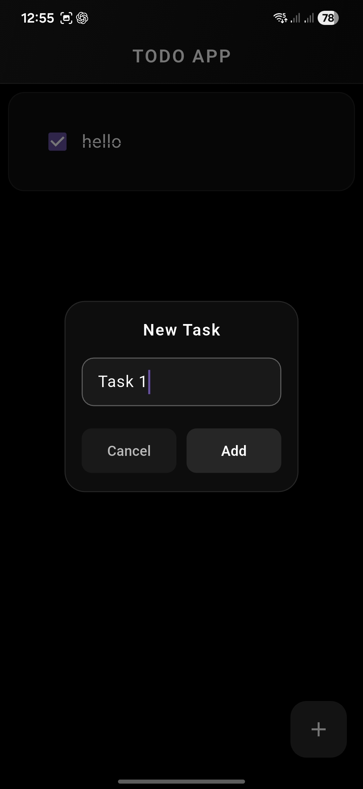
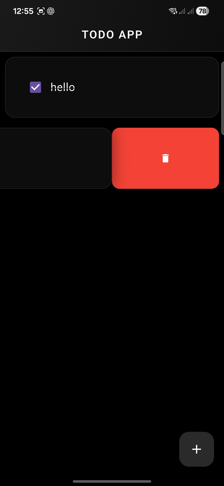

# Flutter Todo App

A clean and minimal **Todo App** built using Flutter with a modern **dark glass UI**.  
Designed for simplicity, smooth performance, and a premium user experience.

---

## ✨ Features

- ✅ Add Tasks  
- 🗑️ Delete Tasks (swipe action)  
- ✔️ Mark tasks as completed  
- 💾 Local storage using Hive  
- 🎨 Dark theme with glass UI  

---

## 🛠️ Tech Stack

- Flutter  
- Dart  
- Hive (Local Database)  

---

## 📱 Preview

### 💻 PC View




### 📲 Mobile View
<p align="center">
  
  
  
</p>

## 📦 APK

Download the latest APK from the **Releases** section.

---

## 🚀 Getting Started

```bash
git clone https://github.com/your-username/your-repo-name.git
cd your-repo-name
flutter pub get
flutter run
